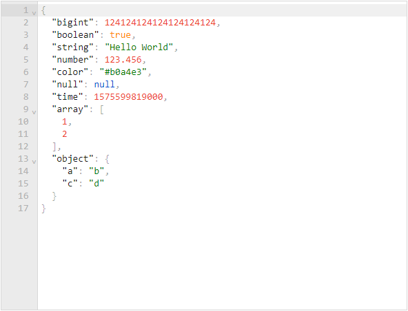
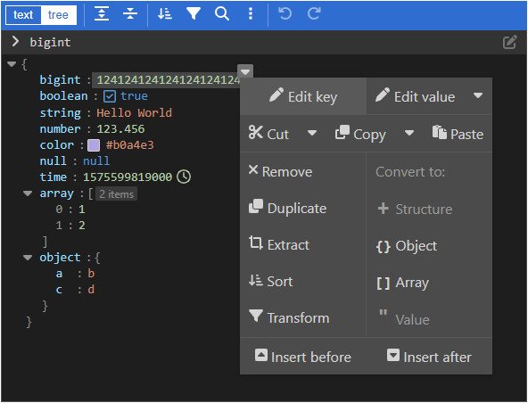

# json-editor-vue

<p align="left">
  <a href="https://npmjs.com/package/json-editor-vue"></a>
  <a href="https://npmjs.com/package/json-editor-vue"></a>
  <a href="https://npmjs.com/package/json-editor-vue"></a>
</p>

> JSON 编辑 & 预览工具，支持 Vue 2.6 / 2.7 / 3，支持 Nuxt 2 / 3，基于 [svelte-jsoneditor](https://github.com/josdejong/svelte-jsoneditor) （[jsoneditor](https://github.com/josdejong/jsoneditor) 的继任者）。

&nbsp;

🕹 [在线试玩](https://cloydlau.github.io/demo/json-editor-vue.html)

<br>

## 特性

- Vue 2.6 / 2.7 / 3 通用
- 支持 SSR，Nuxt 2 / 3 通用
- 编辑模式双向绑定
- 局部注册 + 局部传参，也可以全局注册 + 全局传参（[vue-global-config](https://github.com/cloydlau/vue-global-config) 提供技术支持）

<br>

## 安装

### 外置依赖

- `vue`
- `vanilla-jsoneditor` svelte-jsoneditor 提供的原生包
- `@vue/composition-api` 仅 Vue 2.6 或更早版本需要

<br>

### Vue 3

```sh
npm add json-editor-vue vanilla-jsoneditor
```

#### 局部注册

```vue
<template>
  <JsonEditorVue v-model="value" v-bind="{/* 局部 props & attrs */}" />
</template>

<script setup>
import JsonEditorVue from 'json-editor-vue'

const value = ref()
</script>
```

#### 全局注册

```ts
import { createApp } from 'vue'
import JsonEditorVue from 'json-editor-vue'

createApp()
  .use(JsonEditorVue, {
    // 全局 props & attrs（单向数据流）
  })
  .mount('#app')
```

#### CDN

```html
<div id="app">
  <json-editor-vue v-model="value"></json-editor-vue>
  <p v-text="value"></p>
</div>

<script type="importmap">
  {
    "imports": {
      "vue": "https://unpkg.com/vue/dist/vue.esm-browser.prod.js",
      "vue-demi": "https://unpkg.com/vue-demi/lib/v3/index.mjs",
      "vanilla-jsoneditor": "https://unpkg.com/vanilla-jsoneditor",
      "json-editor-vue": "https://unpkg.com/json-editor-vue@0.7/dist/json-editor-vue.mjs"
    }
  }
</script>
<script type="module">
  import { createApp, ref } from 'vue'
  import JsonEditorVue from 'json-editor-vue'

  createApp({
    setup: () => ({
      value: ref()
    })
  })
    .use(JsonEditorVue)
    .mount('#app')
</script>
```

<br>

### Vue 2.7

```sh
npm add json-editor-vue vanilla-jsoneditor
```

#### 局部注册

```vue
<template>
  <JsonEditorVue v-model="value" v-bind="{/* 局部 props & attrs */}" />
</template>

<script setup>
import JsonEditorVue from 'json-editor-vue'

const value = ref()
</script>
```

#### 全局注册

```ts
import Vue from 'vue'
import JsonEditorVue from 'json-editor-vue'

Vue.use(JsonEditorVue, {
  // 全局 props & attrs（单向数据流）
})
```

#### CDN

```html
<div id="app">
  <json-editor-vue v-model="value"></json-editor-vue>
  <p v-text="value"></p>
</div>

<script type="importmap">
  {
    "imports": {
      "vue": "https://unpkg.com/vue@2/dist/vue.esm.browser.min.js",
      "vue-demi": "https://unpkg.com/vue-demi/lib/v2.7/index.mjs",
      "vanilla-jsoneditor": "https://unpkg.com/vanilla-jsoneditor",
      "json-editor-vue": "https://unpkg.com/json-editor-vue@0.7/dist/json-editor-vue.mjs"
    }
  }
</script>
<script type="module">
  import Vue from 'vue'
  import JsonEditorVue from 'json-editor-vue'

  new Vue({
    components: { JsonEditorVue },
    data() {
      return {
        value: undefined,
      }
    },
  })
    .$mount('#app')
</script>
```

<br>

### Vue 2.6 或更早版本

```sh
npm add json-editor-vue vanilla-jsoneditor @vue/composition-api
```

#### 局部注册

```vue
<template>
  <JsonEditorVue v-model="value" v-bind="{/* 局部 props & attrs */}" />
</template>

<script>
import Vue from 'vue'
import VCA from '@vue/composition-api'
import JsonEditorVue from 'json-editor-vue'

Vue.use(VCA)

export default {
  components: { JsonEditorVue },
  date() {
    return {
      value: undefined,
    }
  },
}
</script>
```

#### 全局注册

```ts
import Vue from 'vue'
import VCA from '@vue/composition-api'
import JsonEditorVue from 'json-editor-vue'

Vue.use(VCA)
Vue.use(JsonEditorVue, {
  // 全局 props & attrs（单向数据流）
})
```

#### CDN

> 由于 `vanilla-jsoneditor` 没有提供 UMD 导出，这样用会有点绕。

```html
<div id="app">
  <json-editor-vue v-model="value"></json-editor-vue>
  <p v-text="value"></p>
</div>

<script>
  window.process = { env: { NODE_ENV: 'production' } }
</script>
<script type="importmap">
  {
    "imports": {
      "vue": "https://unpkg.com/vue@2.6/dist/vue.esm.browser.min.js",
      "@vue/composition-api": "https://unpkg.com/@vue/composition-api/dist/vue-composition-api.mjs",
      "@vue/composition-api/dist/vue-composition-api.mjs": "https://unpkg.com/@vue/composition-api/dist/vue-composition-api.mjs",
      "vue-demi": "https://unpkg.com/vue-demi/lib/v2/index.mjs",
      "vanilla-jsoneditor": "https://unpkg.com/vanilla-jsoneditor",
      "json-editor-vue": "https://unpkg.com/json-editor-vue@0.7/dist/json-editor-vue.mjs"
    }
  }
</script>
<script type="module">
  import { createApp, ref } from '@vue/composition-api'
  import JsonEditorVue from 'json-editor-vue'

  const app = createApp({
    setup: () => ({
      value: ref()
    })
  })
  app.use(JsonEditorVue)
  app.mount('#app')
</script>
```

<br>

### Nuxt 3

```sh
npm add json-editor-vue vanilla-jsoneditor
```

#### 局部注册

```vue
<!-- ~/components/JsonEditorVue.client.vue -->

<template>
  <JsonEditorVue v-bind="attrs" />
</template>

<script setup>
import JsonEditorVue from 'json-editor-vue'

const attrs = useAttrs()
</script>
```

```vue
<template>
  <client-only>
    <JsonEditorVue v-model="value" v-bind="{/* 局部 props & attrs */}" />
  </client-only>
</template>

<script setup>
const value = ref()
</script>
```

#### 全局注册

```ts
// ~/plugins/JsonEditorVue.client.ts

import JsonEditorVue from 'json-editor-vue'

export default defineNuxtPlugin((nuxtApp) => {
  nuxtApp.vueApp.use(JsonEditorVue, {
    // 全局 props & attrs（单向数据流）
  })
})
```

```vue
<template>
  <client-only>
    <JsonEditorVue v-model="value" />
  </client-only>
</template>

<script setup>
const value = ref()
</script>
```

<br>

### Nuxt 2 + Vue 2.7

```sh
npm add json-editor-vue vanilla-jsoneditor
```

#### 局部注册

```ts
// nuxt.config.js

export default {
  build: {
    extend(config) {
      config.module.rules.push({
        test: /\.mjs$/,
        include: /node_modules/,
        type: 'javascript/auto',
      })
    },
  },
}
```

```vue
<template>
  <client-only>
    <JsonEditorVue v-model="value" v-bind="{/* 局部 props & attrs */}" />
  </client-only>
</template>

<script setup>
import { ref } from 'vue'

const JsonEditorVue = () => process.client
  ? import('json-editor-vue')
  : Promise.resolve({ render: h => h('div') })

const value = ref()
</script>
```

#### 全局注册

```ts
// nuxt.config.js

export default {
  plugins: ['~/plugins/JsonEditorVue.client'],
  build: {
    extend(config) {
      config.module.rules.push({
        test: /\.mjs$/,
        include: /node_modules/,
        type: 'javascript/auto',
      })
    },
  },
}
```

```ts
// ~/plugins/JsonEditorVue.client.js

import Vue from 'vue'
import JsonEditorVue from 'json-editor-vue'

Vue.use(JsonEditorVue, {
  // 全局 props & attrs（单向数据流）
})
```

```vue
<template>
  <client-only>
    <JsonEditorVue v-model="value" />
  </client-only>
</template>

<script setup>
import { ref } from 'vue'

const value = ref()
</script>
```

<br>

### Nuxt 2 + Vue 2.6 或更早版本

```sh
npm add json-editor-vue vanilla-jsoneditor @vue/composition-api
```

#### 局部注册

```ts
// nuxt.config.js

export default {
  build: {
    extend(config) {
      config.module.rules.push({
        test: /\.mjs$/,
        include: /node_modules/,
        type: 'javascript/auto',
      })
    },
  },
}
```

```vue
<template>
  <client-only>
    <JsonEditorVue v-model="value" v-bind="{/* 局部 props & attrs */}" />
  </client-only>
</template>

<script>
import Vue from 'vue'
import VCA from '@vue/composition-api'
Vue.use(VCA)

export default {
  components: {
    JsonEditorVue: () => process.client
      ? import('json-editor-vue')
      : Promise.resolve({ render: h => h('div') }),
  },
  data() {
    return {
      value: undefined,
    }
  },
}
</script>
```

#### 全局注册

```ts
// nuxt.config.js

export default {
  plugins: ['~/plugins/JsonEditorVue.client'],
  build: {
    extend(config) {
      config.module.rules.push({
        test: /\.mjs$/,
        include: /node_modules/,
        type: 'javascript/auto',
      })
    },
  },
}
```

```ts
// ~/plugins/JsonEditorVue.client.js

import Vue from 'vue'
import VCA from '@vue/composition-api'
import JsonEditorVue from 'json-editor-vue'

Vue.use(VCA)
Vue.use(JsonEditorVue, {
  // 全局 props & attrs（单向数据流）
})
```

```vue
<template>
  <client-only>
    <JsonEditorVue v-model="value" />
  </client-only>
</template>

<script>
export default {
  data() {
    return {
      value: undefined,
    }
  },
}
</script>
```

<br>

## Props

| 参数名  | 说明                                                                                                 | 类型               | 默认值   |
| ------- | ---------------------------------------------------------------------------------------------------- | ------------------ | -------- |
| v-model | 绑定值                                                                                               | `any`              |          |
| mode    | 编辑模式，<br>在 Vue 3 中使用 `v-model:mode`，<br>在 Vue 2 中使用 `:mode.sync`                       | `'tree'`, `'text'` | `'tree'` |
| ...     | [svelte-jsoneditor](https://github.com/josdejong/svelte-jsoneditor/#properties) 的参数（通过 attrs） |                    |          |

### `svelte-jsoneditor` 与 `json-editor-vue` 中绑定值的差异

- `svelte-jsoneditor` 一个包含「stringified JSON」或「parsed JSON」的对象，当作为「stringified JSON」传入时，会经过 `JSON.parse` 解析。
- `json-editor-vue` JSON 本身，所见即所得。

> 详情见 https://github.com/josdejong/svelte-jsoneditor/pull/166.

### 布尔类型参数

仅写上 `svelte-jsoneditor` 的布尔类型参数如 `readOnly` 但不传值，会隐式转换为 `true`：

- ✔️ `<JsonEditorVue readOnly />`

- ✔️ `<JsonEditorVue :readOnly="true" />`

> 通过 CDN 使用时，标签、prop 名称都必须使用短横线命名

<br>

## Expose

| 名称       | 说明            | 类型   |
| ---------- | --------------- | ------ |
| jsonEditor | JSONEditor 实例 | object |

<br>

## 类型

```ts
type Mode = 'tree' | 'text'
```

<br>

<a name="dark-theme"></a>

## 暗色主题

```vue
<template>
  <JsonEditorVue class="jse-theme-dark" />
</template>

<script setup>
import 'vanilla-jsoneditor/themes/jse-theme-dark.css'
import JsonEditorVue from 'json-editor-vue'
</script>
```

<br>

## 更新日志

各版本详细改动请参考 [release notes](https://github.com/cloydlau/json-editor-vue/releases) 。

<br>

## 开发

**PR welcome!** 💗

1. 安装 Deno: https://x.deno.js.cn/#%E5%AE%89%E8%A3%85%E6%9C%80%E6%96%B0%E7%89%88

2. `npm add pnpm @cloydlau/scripts -g; pnpm i`

3. 启动

    - `pnpm dev3`
    - `pnpm dev2.7`
    - `pnpm dev2.6`

<br>
